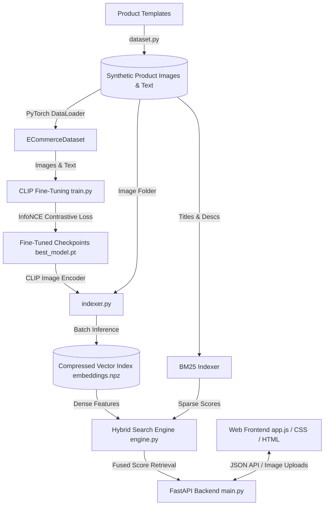

# OmniSearch-ML: Multimodal Semantic Search & Retrieval System for E-Commerce

An advanced, end-to-end multimodal product retrieval and recommendation system designed to align text descriptions with product images. The project features a **CLIP (Contrastive Language-Image Pretraining)** fine-tuning pipeline, a **hybrid search engine** fusing sparse lexical (BM25) and dense semantic vector retrieval, and a premium **glassmorphism analytics dashboard**.

This system is built from scratch using **PyTorch**, Hugging Face **Transformers**, **FastAPI**, and vanilla **HTML/CSS/JS** with hardware acceleration support.

---

## 🚀 Key Features

* **Multimodal Contrastive Fine-Tuning**: A PyTorch-based training pipeline that fine-tunes OpenAI's CLIP model using symmetric Cross-Entropy (**InfoNCE**) loss to align custom e-commerce product texts and images in a shared embedding space.
* **Lexical & Semantic Hybrid Search**: Integrates traditional keyword-based matching (**BM25**) with dense visual-textual vector retrieval. Features a dynamic linear score-fusion weight slider ($0\%$ to $100\%$).
* **Visual Search & Drag-and-Drop Image Retrieval**: Allows users to drag, drop, or select product images to query the catalog, finding visually and contextually similar products.
* **Content-Based Visual Recommendations**: Employs cosine similarity mapping over generated image embeddings to recommend visually matching items.
* **Background Training Dashboard**: An interactive playground where users can trigger CLIP model training in a background thread and observe real-time loss and alignment accuracy curves.
* **Self-Elevating Orchestrator**: Running `python run.py` automatically detects and elevates execution into the python virtual environment (`.venv`), handles dataset generation, indexes the catalog, and boots the FastAPI server.

---

## 📐 System Architecture



---

## 🧠 Core ML Methodologies

### 1. Contrastive Learning & Symmetric Loss (InfoNCE)
For a batch of $N$ product image-text pairs, the model is trained to maximize the cosine similarity of the matched $N$ pairs while minimizing the similarity of the $N^2 - N$ unmatched negative pairs. The symmetric contrastive loss is calculated as:

$$\mathcal{L}_{i \to t} = -\frac{1}{N} \sum_{k=1}^{N} \log \frac{e^{\text{sim}(i_k, t_k) / \tau}}{\sum_{j=1}^{N} e^{\text{sim}(i_k, t_j) / \tau}}$$

$$\mathcal{L}_{t \to i} = -\frac{1}{N} \sum_{k=1}^{N} \log \frac{e^{\text{sim}(t_k, i_k) / \tau}}{\sum_{j=1}^{N} e^{\text{sim}(t_k, i_j) / \tau}}$$

$$\mathcal{L}_{\text{total}} = \frac{1}{2} \left( \mathcal{L}_{i \to t} + \mathcal{L}_{t \to i} \right)$$

where $\text{sim}(u, v) = \frac{u \cdot v}{\|u\|_2 \|v\|_2}$ represents cosine similarity, and $\tau$ is a learnable temperature parameter scaling the logits.

### 2. Hybrid Search Fusion
Keyword search matches specific terms (brand names, sizes) but fails at visual themes. Dense search catches style/composition but misses precise names. We fuse normalized BM25 scores and CLIP cosine similarities using a parameter $w$:

$$S_{\text{hybrid}} = w \cdot S_{\text{dense\_normalized}} + (1 - w) \cdot S_{\text{sparse\_normalized}}$$

---

## 📁 Repository Structure

```
├── data/                       # Product catalog metadata and generated images
│   ├── catalog.json            # Main JSON database mapping product metadata
│   ├── embeddings.npz          # Saved NumPy arrays of visual & textual embeddings
│   ├── checkpoints/            # Saved weights of the fine-tuned CLIP model
│   └── history.json            # Saved metric logs of the training runs
├── src/
│   ├── model/                  # Training and PyTorch dataset modules
│   │   ├── dataset.py          # Vector shape drawer & PyTorch dataset wrapper
│   │   ├── model.py            # Neural architecture wrapper around CLIP
│   │   └── train.py            # Local InfoNCE model fine-tuning routine
│   ├── search/                 # Retrieval and indexing pipeline
│   │   ├── indexer.py          # Pre-computes product embeddings
│   │   └── engine.py           # Hybrid (BM25 + CLIP) scoring algorithm
│   └── api/                    # Web-serving APIs
│       └── main.py             # FastAPI router and background worker thread
├── frontend/                   # Beautiful analytics and search dashboard
│   ├── index.html              # HTML structure with CDN integration
│   ├── styles.css              # Custom HSL-based dark mode glassmorphism UI
│   └── app.js                  # Frontend logic, upload drag-and-drop, Chart.js mapping
├── requirements.txt            # Project library requirements
└── run.py                      # Main entrypoint driver
```

---

## 🛠️ Installation & Getting Started

### Prerequisites
* Python 3.10+ (Python 3.14.3 is verified working)
* NVIDIA GPU with CUDA support (Recommended, fallback to CPU is automatic)

### Quick Start
1. Clone the repository to your local workspace:
   ```bash
   git clone https://github.com/atharva635/OmniSearch-ML.git
   cd OmniSearch-ML
   ```

2. Create a virtual environment (if not already created):
   ```bash
   python -m venv .venv
   ```

3. Run the orchestrator script:
   ```bash
   python run.py
   ```
   *Note: Running `python run.py` will automatically elevate execution to run inside `.venv`, install missing requirements, generate the synthetic dataset, build the vector search index, and start the FastAPI web server.*

4. Open your browser and navigate to:
   ```
   http://localhost:8000
   ```

### Command-line Parameters
The `run.py` driver supports several command-line flags to trigger isolated steps:
* Generate catalog metadata and images:
  ```bash
  python run.py --prep
  ```
* Fine-tune the CLIP model locally:
  ```bash
  python run.py --train --epochs 5
  ```
* Pre-compute vector embeddings index:
  ```bash
  python run.py --index
  ```
* Change serving port (default is 8000):
  ```bash
  python run.py --port 8080
  ```

---

## 📊 Evaluation & Verification

The model is evaluated during validation by calculating the **Image-to-Text (I2T)** and **Text-to-Image (T2i)** top-1 and top-5 retrieval accuracy:
1. **Top-1 Recall**: Checks if the target matching item has the highest similarity score.
2. **Top-5 Recall**: Checks if the target matching item is within the top-5 retrieved items.

Training metrics are logged inside `data/history.json` and are visualized instantly under the **Analytics** tab of the dashboard.
